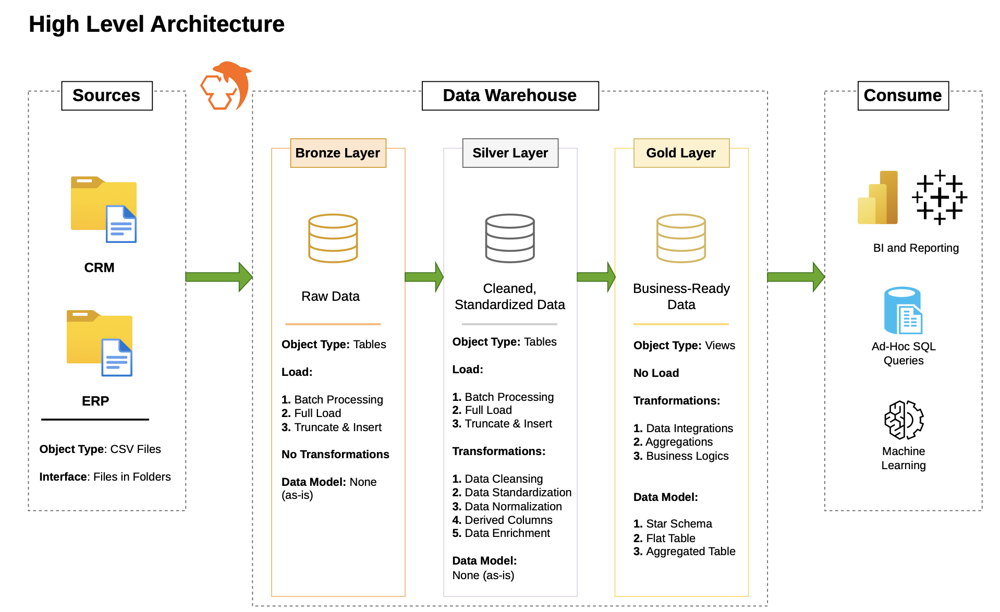
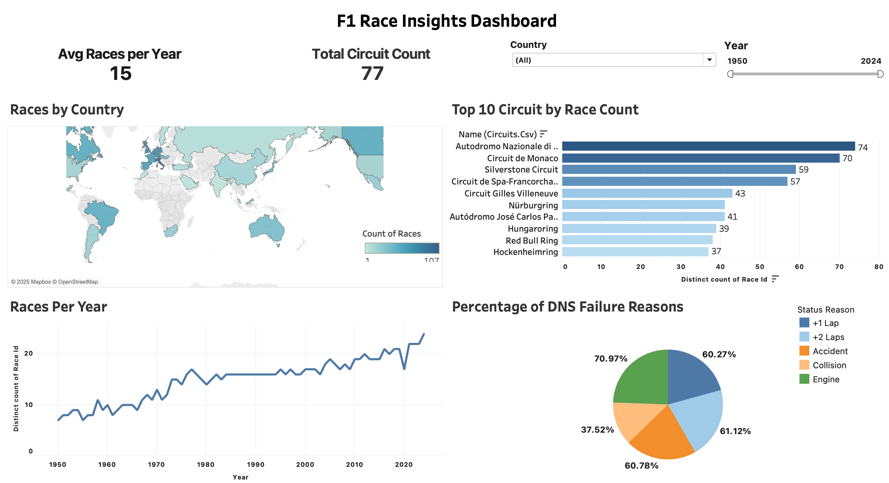
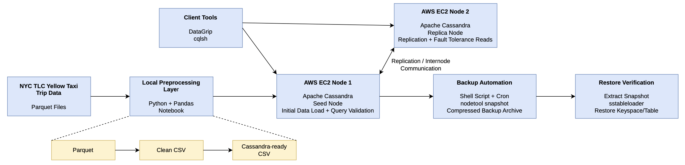
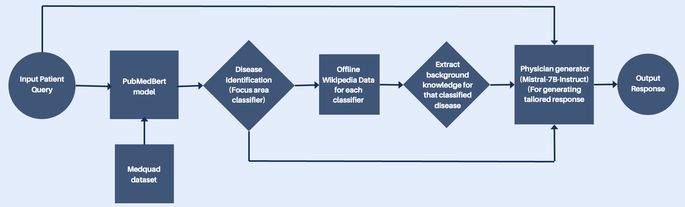
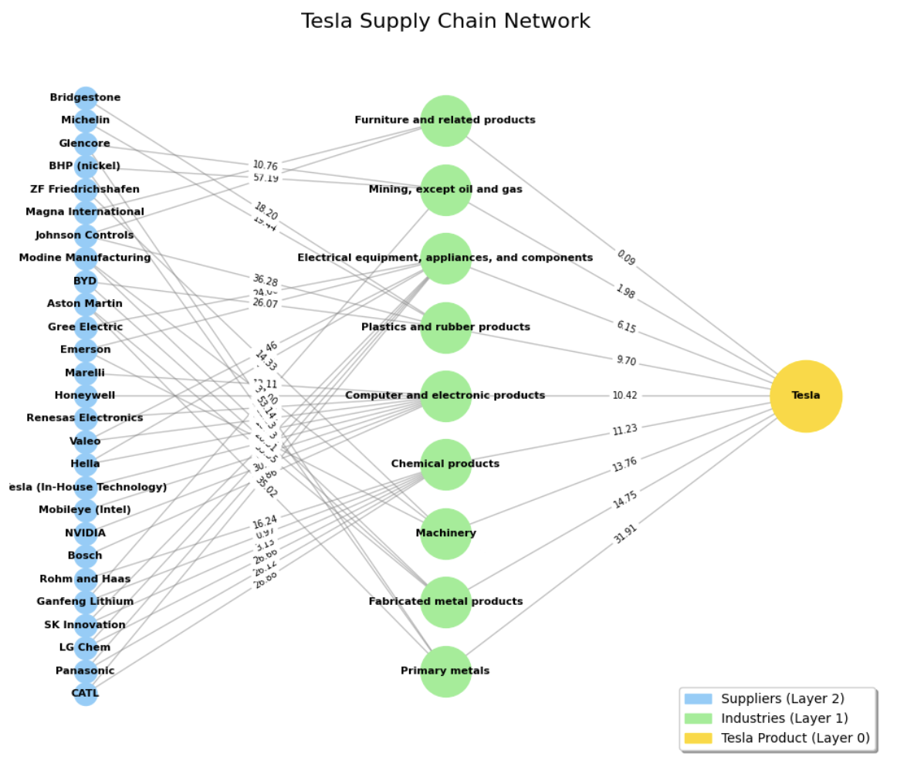
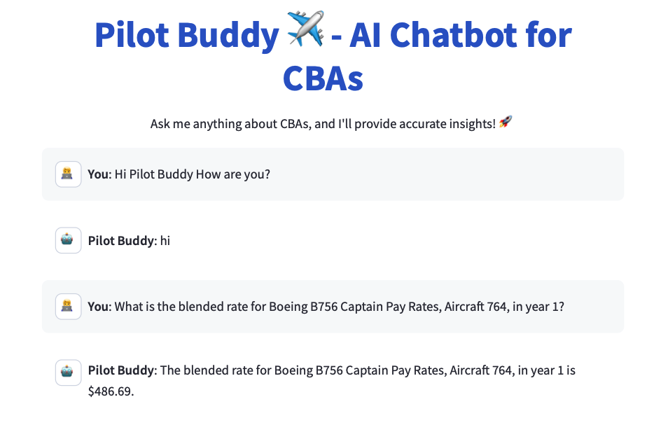

# Hey, I’m Dhyey 👋

## What I work on
- **Analytics engineering:** dimensional modeling (star schema), KPI definitions, reporting-ready datasets  
- **Data pipelines & platforms:** ETL/ELT workflows, cloud deployments, scalable storage/query patterns  
- **Applied analytics:** turning messy data into decision-ready insights and dashboards
- **Technical consulting:** translating stakeholder needs into clear requirements, solution designs, and deliverables (dashboards, data workflows, and client-ready recommendations)

---

## 📂 Featured projects
> A curated selection of my work. Click on any project to explore its full repository and documentation.

### 1) Customer & Sales Analytics Data Warehouse (MySQL)
- Built a **Bronze/Silver/Gold** pipeline and star-schema reporting layer for KPI analytics (**60K+ records**).
- Delivered reusable SQL reporting for **customer behavior, product performance, and sales trends**.  
🔗 **Repo:** [Customer & Sales Analytics Data Warehouse](https://github.com/DK-3333/Customer-and-Sales-Analytics-Data-Warehouse)  

---

### 2) F1 Performance Analytics Dashboard (Python + Tableau)
- Built interactive Tableau dashboards on **1950–2024** F1 history with drill-down KPIs across teams/drivers/circuits.
- Unified multi-source datasets and implemented KPI logic (e.g., driver contribution metrics).  
🔗 **Repo:** [F1 Performance Analytics Dashboard](https://github.com/DK-3333/F1-Data-Analytics)  

---

### 3) Fault-Tolerant Cassandra Cluster on AWS
- Deployed a **2-node Cassandra cluster** on AWS and validated operations (health checks, access controls, backup/restore).
- Loaded **3,724,889 rows** in **9m 10s** (**6,771 rows/sec**) with **0 skipped records** and demonstrated node-failure continuity.  
🔗 **Repo:** [Fault-Tolerant Cassandra Cluster on AWS](https://github.com/DK-3333/Self-Managed-and-Fault-Tolerant-Apache-Cassandra-Cluster-on-AWS-Using-NYC-TLC-Trip-Data)  

---

### 4) RAG Clinical Q&A Assistant
- Built a retrieval-grounded clinical Q&A pipeline using **PubMedBERT** (trained on ~**15K** MedQuAD Q&A pairs) + **Mistral-7B-Instruct**.
- Grounded answers using offline retrieval and controlled context (~**450 tokens**) to reduce hallucination risk.  
🔗 **Repo:** [RAG Clinical Q&A Assistant](https://github.com/DK-3333/Dr-Bot-LLM-Clinical-Assistant)  

---

### 5) Monte Carlo Supply-Chain Risk Simulation
- Ran **10K Monte Carlo simulations** to estimate expected loss and **p95 tail risk** under disruption scenarios.
- Analyzed correlated shock behavior to highlight cluster-risk vs independent failures.  
🔗 **Repo:** [Monte Carlo Supply-Chain Risk Simulation](https://github.com/DK-3333/Monte-Carlo-Simulation-of-Supplier-Disruptions-and-Their-Impact-on-an-EV-Manufacturer-s-Production)  

---

### 6) Pilot Buddy Flight Compliance Assistant (Consulting Prototype)
- Built a Streamlit prototype using **LangChain + FAISS** for semantic search over policy/contract text.
- Designed a structured data layer (MySQL) to support logs and workflow tracking.  
🔗 **Repo:** [Pilot Buddy Flight Compliance Assistant](https://github.com/DK-3333/Flight-Decision-Matrix-Application)  

---

## Tech I work with
**SQL/DB:** MySQL, PostgreSQL, Cassandra, MongoDB, Neo4j  
**Python:** pandas, NumPy  
**BI:** Tableau, Power BI, Excel  
**Cloud/Data:** AWS, Azure, Databricks, Spark/PySpark, Airflow  
**Tools:** Git, Docker, Linux/Unix CLI, VS Code

---

## Connect
- 
- 

